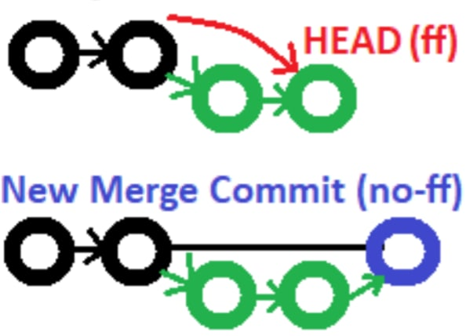
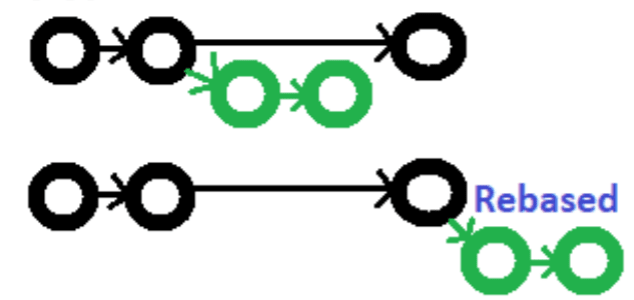

# Git - https://git-scm.com/


>Git is a free and open source distributed version control system designed to handle everything from small to very large projects with speed and efficiency.

## Download, Install & Setup
This part maybe slow and self explanitory for some.

### Download
1. Proceed to the website https://git-scm.com/downloads and download the latest version of Git that correlates to your computer's OS. (Should be the version diplayed by default on the page)

### Install
2. Install said software with default values. (If there are particular setting you know you want, choose them now)
    1. Run installer
    2. Select Components
    3. Choosing the default editor used by Git
        > Vim is the default editor of Git for windows only for *historical reasons*, and it is highly recommended to switch to a modern GUI editor instead.
        - If the description of the editor is grayed out, it has been deprecated and can no longer be used.
        - Modern editors:
            - Visual Studio Code (VSCode)
            - Notepad++
        - But the choice is ultimatley whatever text editor you are most comfortable with.
    4. Adjusting the name of the initial branch in new repositories.
        - You can *Let Git decided* but
            > the Git project [intends](https://sfconservancy.org/news/2020/jun/23/gitbranchname/) to change this default (master) to a more inclusive name in the near future.
        - As such it is recommended to choose **Override the default branch name for new repositories** with the override being "main"
    5. For the rest of the options default  
    [Git Credential Manager](https://github.com/git-ecosystem/git-credential-manager)  
    [Info about GCM](https://github.com/git-ecosystem/git-credential-manager/blob/HEAD/docs/faq.md#about-the-project)

### Setup
3. After you finish installing Git, you're going to need to setup the config a bit. To do that we will need to open a Git Terminal, either GitBash or GitCMD will work for this. Once open we will begin setup.
    1. #### Name Setup
    Attached your name to Git. This is very important because this name will be attached to every commit you make. You have two options with this. You cam attach your first and last names, or you can enter your chosen username that you associate with a *Git Repo Service* such as **GitHub**.  
    Run the following command in the Git Terminal(remove the square brackets entering your information, but leave the quotes):  
    ``git config --global user.name "[firstname lastname]"``  
    or  
    ``git config --global user.name "[name]"``  
    The ``--global`` flag assigns this name to the entire computer config.


    2. #### Email Setup
    Attach your email to Git. Arguably just as important as the name attached, this is the email you associate with your Git. If you are using an online service such as **GitHub** you should use the email associated with that account. (GitHub has an anonymous email you can use to links your username.)  
    Run the following
    Command in the Git
    Terminal(remove the
    square brackets entering your information, but leave the quotes):  
    ``git config --global user.email "[email@email.com]"``  

    3. #### Basic Config Options
    - The following command setups the colors in the Git CMD and Bash  
    ``git config --global color.ui auto``

    - this command sets your default branch name to *main* from the antiquated *master*, if you didn't do that in the inital setup when installing Git.  
    ``git config --global init.defaultBranch main``

## Baisc Commands
Most modern IDE's have integrated and easy ways to perform most, if not all of these operations. Later we can go over how to perform them in a couple of popular IDEs.

## Starting a Project

### Create a local Repo
``git init [project name]``
This will initialize a new local git repo in the *project name* directory. If you omit the project name git will initialize the cirrent directory as a git repo.

### Download a Remote Repo
``git clone <url.git>``
Downloads a project and the entire git history from a remote repo hosted on a service such as **GitHub**  
The **.git** extension is ***important*** 


## Make a Change

### Adding Files
``git add [file]``  
Add a file to the staging area. Instead of the full file path, use the current directory down into the directory tree.  

``git add .``  
Adds all files to the staging area. **This is a bad practice**

### Commiting Files
``git commit -m "[descriptive message]"``  
Commit all your staged changes to git.

``git commit -am "[descriptive message]"``  
Add all changes made to tracked files & commit


## Branches
``git branch``  
List all branches. (An a* will appear next to the currently active branch)  
Add `-r` flag to show all remote branches, `-a` flag for all branches.

``git branch [branch-name]``  
Create a new branch with the current commit.

``git checkout [branch-name]``  
Switch to the specified branch and updates the working directory.  

``git checkout -b [branch-name]``  
Create a new branch and switch to it.

``git branch -d [branch]``  
Deletes specified merged branch. 

``git branch -D [branch]``  
Deletes specified branch whether merged or not.

``git tag [tag-name]``  
Add a tag to current commit (often used for new version releases)


## Merging
Merge branch `a` into branch `b`. Add `--no-ff` option for no-fast-forward merge.  
  
Credit to dev.to/doabledanny

``git checkout b``  
Change currecnt active directory to branch b

``git merge a``  
Merge branch a into branch b

``git merge --squash a``
Merge & squash all commits into one new commit


## Rebasing
Rebase *feature* branch onto *main* (to incorporate new changes made to main). Prevents unnecessary merge commits into feature, keeping history clean.  
  
Credit to dev.to/doabledanny

``git checkout feature``  
``git rebase main``

``git rebase -i main``  
Interactivley clean up a branches commits before rebasing onto main

``git rebase -i Head~3``  
Interactively rebase the last 3 commits on current branch


## Undoing Things

``git mv [ existing_path] [new_path]``  
Move and or rename a file & stage move

``git rm [file]``  
Remove file from working directory & staging area, then stage the removal.

``git rm --cached [file]``  
Remove file from staging area only.

``git chekcout [commit_ID]``  
View a previous commit **(READ ONLY)**

``git revert [commit_ID]``  
Create a new commit, reverting the changes from a specified commit.

``git reset [commit_ID]``  
Go back to a previous commit & delete all commits ahead of it **(revert is safer)**. Add ``--hard`` flag to also delete workspace changes ***(BE VERY CAREFUL)***

``git reset [file]``  
Unstage a file while retaining the changes in the working directory.


## Review your Repo

``git status``  
Show the status of the files in your working directory and staged for the next commit.

``git log --oneline``  
List commit history, with respective IDs

``git diff``  
Show changes to unstaged files. For changes to staged files, add ``--cached`` flag

``git diff commit1_ID commit2_ID``  
Show changes between two commits

``git diff [file]``  
Shows the difference between the working directory and the staging area.

``git diff --staged [file]``  
Shows differences between **staging area** and **repository**  


## Stashing

``git stash``  
Store modified & staged changes. To include untracked files, ass ``-u`` flag. For untracked & ignored files, add ``-a`` flag.

``git stash save "comment"``  
Same as ``git stash`` but with a comment

``git stash -p``  
Partial stash. Stash just a single file, a collection of files, or individual changes from within files.

``git stash list``  
List all stashes

``git stash apply``  
Re-apply the stash without deleting it.

``git stash pop stash@{2}``  
Re-apply the stash at index 2, then delete it from the stash list. Omit ``stash@{n}`` to pop the most recent stash

``git stash show stash@{1}``  
Show the diff summary of stash 1. Pass the ``-p`` flag to see the full diff.

``git stash drop stash@{1}``  
Delete stash at index 1. Omit ``stash@{n}`` to delete last stash made

`` git stash clear``  
Delete all stashes


## Synchronizing

``git remote add [alias] [url]``  
Add a git url as an alias  

``git remote``  
View all remote connections. Add ``-v`` flag to view urls.

``git remote remove [alias]``  
Remove a connection

``git remote rename [old] [new]``  
Rename a connection

``git fetch [alias]``  
Fetch all branches from remote repo (no merge)

``git fetch [alias] [branch]``  
Fetch a specfic branch

``git pull``  
Fetch the remote repo's copy of the current branch, then merge.

``git merge [alias]/[branch]``  
Merge remote branch onto current branch, bringing it up to date.

``git pull --rebase [alias]``  
Move (rebase) your local changes onto the top of new changes made to the remote repo (for clean, linear history).

``git push [alias]``  
Upload local content to remote repo

``git push [alias] [branch]``  
Upload to a branch (can then pull request)


## Logs

``git log``   
Displays all commits in current working directory.  

``git log --follow [file]``  
Display list of version history including renames for the specified file.  

``git log [first-branch]..[second-branch]``  
Display the difference in the commits.

``git log --stat -M``  
Display all commit logs relating to any paths that moved.

``git diff [first-branch]...[second-branch]``  
Display the content difference between the two specified branches.

``git show [commit]``  
Displays metadata and content changes kf the specified commit.


## Ignoring Files and Directories (.gitignore)

A **.gitignore** specifies intentionally untracked files to ignore. In layman's terms; it allows you to specify which files and directories git shouldn't track or add to the repo. 

### Why?
A reason to include this .gitignore file would be to minimize your repo size. A smaller repo is easier to maintain. 

### What Would I Include?
A good rule of thumb for which files and directories  to include would be items that are automatically generated by the system, or files you want to be updated regularly.

#### Examples 
Such flies or directories could include:
JavaScript *Node Modules*, these are easily generated using ``npm install``.

### Ignoring Patterns
\* is a wildcard
```
logs/
*.notes
pattern*/
```

### How to Use
1. Create a file and name it ``.gitignore`` file within the source directory of the data you are commiting to git.
2. Enter in the file the gerneralized path to the file(s) you want ignored inrealtion to that source folder, or enter pattern matching critera of files to be ignored. ``.log``


## Glossery

### Git
An open source, distributed version-control system
### GitHub
A platform for hosting and collaborating on Git repositories
### Commit
A Git object, a snapshot of your entire repository compressed into a SHA
### Clone
A local version of a repository, including all commits and branches
### Branch
A lightweight movable pointer to a commit
### Tag
### main
Default development branch
### origin
Default upstrem repo
### HEAD
representing your current working directory, the HEAD pointer can be moved to different branches, tags, or commits when using ``git checkout``
### HEAD^
Parent of HEAD
### HEAD~4
Great-great grandparent of HEAD
### Repo

### remote
A common repository on GitHub that all team member use to exchange their changes
### fork
A copy of a repository on GitHub owned by a different user
### pull request
A place to compare and discuss the differences introduced on a branch with reviews, comments, integrated 
tests, and more.

## Try it Out!

## Basic Procedure
### Initialize or Clone a Repo
``git init``
